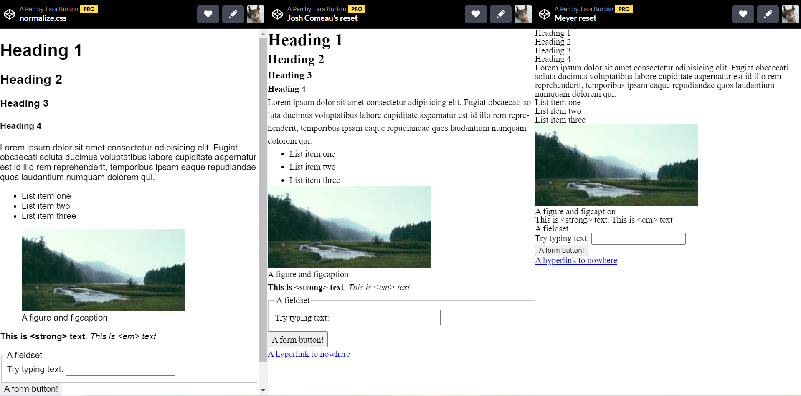
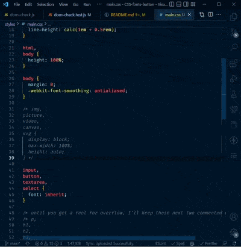
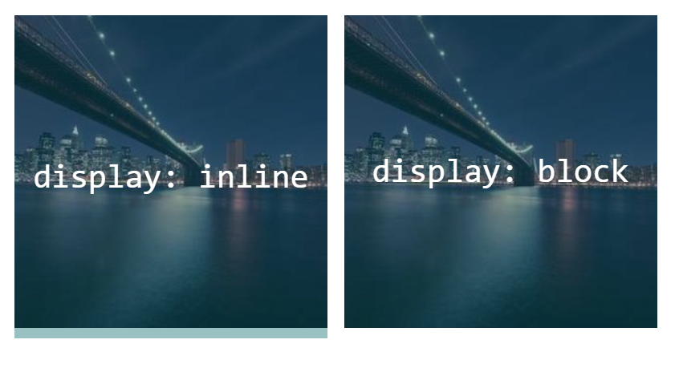
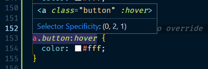
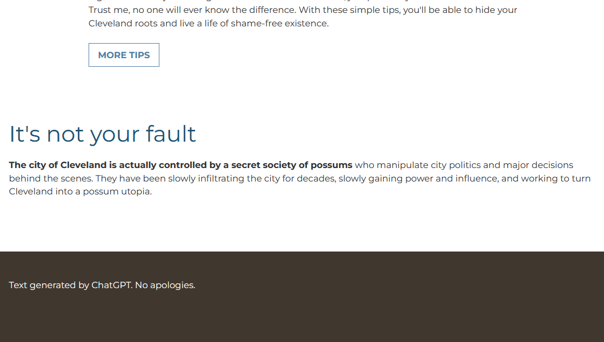

<!-- cSpell:enable  -->
# CSS fonts and a button

**Objectives**: Learn how to use CSS stylesheets. Understand what  user-agent stylesheets are and the purpose of CSS resets. Add web fonts to your website. Create a button class to style links to appear as "web buttons." Adjust whitespace to keep your pages from looking crowded.

**Concepts covered**: CSS resets, box-model, CSS variables, pseudo-classes, simple transitions.

| :warning: This assignment builds on your _Responsive images and SVG images_ assignment                                                                                                                                                                                                                                                                                                                                                                                                                                                                                                                                                       |
| :------------------------------------------------------------------------------------------------------------------------------------------------------------------------------------------------------------------------------------------------------------------------------------------------------------------------------------------------------------------------------------------------------------------------------------------------------------------------------------------------------------------------------------------------------------------------------------------------------------------------------------------- |
| After cloning this repo and opening it in VSCode, copy the following files and folders from your _Responsive images and SVG images_ assignment into this repo.<br><br><ul><li>📄 index.html</li><li>📄 favicon.ico</li><li>📁styles</li><li>📁images</li><li>📁about</li><li>📁contact</li></ul><br>**Make sure that you don't copy any other folders or files, including the `test` folder, the hidden `.git` and `.github` folders, and the `package.json` files**<br><br>You can remove the inline SVG from your main `index.html` if it doesn't fit with your design. <br><br>You can also remove `<figure>` and `<figcaption>` from your image if you'd prefer. |

## CSS reset stylesheets

Browsers have  _user-agent stylesheets_ that provide default styling for HTML elements. Since each vendors' user-agent stylesheet styles the HTML differently, most developers use a CSS reset stylesheet to make sure their websites look consistent across all browsers. Most CSS frameworks also use a reset. Bootstrap, for example, uses [Reboot](https://getbootstrap.com/docs/4.0/content/reboot/) which is based on normalize.css. Some popular CSS resets include the following:

- [normalize.css](https://necolas.github.io/normalize.css/) - a popular CSS reset that keeps some default styles. I recommend this for beginners.
- [Josh Comeau's simple reset](https://www.joshwcomeau.com/css/custom-css-reset/) - a minimalistic modern alternative to normalize.css that keeps many default styles but is notably different from normalize as it removes all margins, adds line spacing, and doesn't set a default font.
- [Eric Meyer's Reset](https://meyerweb.com/eric/tools/css/reset/) - one of the original CSS resets. It removes all default styles. This requires you to add styles for all elements.

[View a CodePen comparing these three CSS resets 
](https://codepen.io/lsburton/live/yLqwyOd)

This semester, I included Josh Comeau's simple reset in the `styles/main.css` file. You should have added this file to all your HTML files in the previous assignment. I did comment out some of the resets that I didn't want to use until you understood the concepts, so you'll need to uncomment them.

### Uncomment the resets

Let's uncomment some resets for this assignment. Open `styles/main.css`. On line 16, remove the comment marks `/*  */` around  `margin: 0;` so it looks like this:

```css
* {
  margin: 0;
  /* this an experimental line-height; if it breaks, add line-height: 1.5 to body */
  line-height: calc(1em + 0.5rem);
}
```

Next, go to line 31 and uncomment this block (see the tip below for a shortcut to comment and uncomment blocks of code):

```css

```css
img,
picture,
video,
canvas,
svg {
  display: block;
  max-width: 100%;
  height: auto;
}
```

| 💡 Shortcut to quickly comment and uncomment blocks of code in VSCode |
|:-----|
|1. Select the lines you want to comment or uncomment<br>2. Press `Ctrl` + `/` (Windows) or `⌘` + `/` (Mac)<br><br> |

### An aside on images and `display: block`

One of the more "annoying" CSS quirks for beginnners is that, by default, images are inline elements. This made sense when the web was first created and its focus was on text, but now that we frequently use standalone images, it can cause some problems, especially when adding overlays (because an inline element has line height, overlays over images will have a gap at the bottom because of `line-height`). If the image is set to `display: block` as it is in this reset, it loses the `line-height` and an overlay will be flush with the bottom of the image. In the image below, the overlay is a transparent blue-green color.



_[Link to the CodePen](https://codepen.io/lsburton/pen/eYjXmqg?editors=1100) that generated this image._

 The `max-width: 100%` property keeps large images from overflowing thier containers, but you may need to override it on occasion; however, that's for a later lesson. I added the `height: auto` property to make sure images keep their aspect ratio and don't appear squashed.

## CSS variables and the `:root` selector

Since colors are used in many places, it's a good idea to define them as variables. This way, if you decide to change your color scheme, you only need to change the variable values instead of finding and changing every instance of the color.

Variables that are used throughout your website are best added to the `:root` selector. This is a special selector that represents the root element of the document. It's almost the same as the `html` selector, but, because it is a pseudo-class, it has a higher specificity.

At the top of your `styles/main.css` file, add your style guide colors as CSS variables. You can name the variable using its color or its purpose, e.g. `--dark-blue` or `--primary-heading`.

Developers do both and argue over which is best.
| 📖 Naming color variables |
| :----------------------------------------------------------------------------------------------------------------------------------------------------------- |
| Review CSS Trick's [What do you name color variables?](https://css-tricks.com/what-do-you-name-color-variables/) for naming ideas |

Here are two samples of how you might define your colors:

```css
:root {
  --dark-blue: #0a192f;
  --light-blue: #c7d2fe;
  --lightest-blue: #e2e2e2;
  --off-white: #e6f1ff;
  --text-color: #333;
}
```

or

```css
:root {
  --color-font: #333;
  --color-primary: #205373;      /* dark blue */
  --color-secondary: #517EA6;    /* light blue */
  --color-accent: #A6653F;       /* orange brown */
  --color-accent-light: #F2BC8D; /* light tan */
}
```

I personally prefer the second style. I also tend to prefix the variable "type" to the variable name to help organize long lists of variables.

Variables aren't limited to colors and can be used for other values, such as font sizes, spacing, and box shadows &ndash; basically anything that you might want to reuse.

### An aside: `html` vs `:root` vs `*`

`<html>` and `:root` refer to the same element, but since `:root` is a pseudo-class, it has a higher specificity than the `html` selector, so it will always override it.

The universal selector `*` is a little different. It applies properties to every element. `<html>` and `:root` only pass down inheritable properties. For example, `background-color` is an inheritable property. If set in `:root` like this:

```css
:root {
  background-color: papayawhip;
}
```

It will appear to be the same as

```css
* {
  background-color: papayawhip;
}
```

because the `background-color` will be inherited by all elements. However, if you set a property that is not inheritable, such as `border`, it will not be inherited. So

```css
:root {
  border: 6px solid rebeccapurple;
}
```

and

```css
* {
  border: 6px solid rebeccapurple;
}
```

will behave differently. The `border` will only be applied to the `:root` element in the first example, but will be applied to every element in the second example. Try it out in a CodePen!

| :bulb: Cascade, specificity, and inheritance |
:-----|
| To learn more see MDN's [Cascade, specificity, and inheritance](https://developer.mozilla.org/en-US/docs/Learn/CSS/Building_blocks/Cascade_and_inheritance) or, while it's an older article, it's still quite helpful, Sitepoint's [CSS Inheritance: An Introduction](https://www.sitepoint.com/css-inheritance-introduction/). |

## Adding fonts

We'll use [Google fonts](https://fonts.google.com/) in this course because they are free and they are easy to use. For detailed info and a video tutorial on adding Google fonts, see [Using web fonts from a font delivery service](https://fonts.google.com/knowledge/using_type/using_web_fonts_from_a_font_delivery_service).

- Go to [Google Fonts](https://fonts.google.com/) and select the two fonts from your style guide. If your font has bold and italic variants, make sure to select those as well, but don't go overboard and select every variant. For now, choose one bold and one italic variant if they are available.
- Add the `<link>` elements generated by Google Fonts to the `<head>` on **each of your three web pages.** Make sure to add both fonts at once (you want one copy-and-paste from Google Fonts, not two). **The fonts should be loaded before (above) your** `styles/main.css` **file.**
- In `styles/main.css`, use the `font-family` property generated by Google Fonts to set the font for your `body` and headings `h1, h2, h3, h4`. Add any CSS declarations you create below the resets. I added a comment in the CSS file to help you find the right place.

  ```css
  /************ add your CSS here *****************/
  ```

- Assign colors to your `body` and headings using the `color` property and your CSS variables. For example:

  ```css
  color: var(--color-heading);
  ```

### Optional

- Use the `font-weight` property to set the weight of your headings and body text. If you choose a darker or lighter bold font weight such as Meidum 500 or Black 900 (default bold weight is 700), you can set the weight using the number, e.g. `font-weight: 500;`.
- Use the `font-size` property to set the size of your headings and body text. A current design trend is large headings, so you might want to make your headings larger than the default. For accessibility reasons, it's best to set the font size using `rem` units, which are relative to the base font size. This will allow users with vision impairments to change the base font size in their browser settings and have your fonts re-size appropriatley.

| 💡 Loading fonts in HTML vs CSS |
|:------|
| You can load fonts in HTML using `<link>`, but you can also load them in a CSS file using `@import`. If you use a CDN like Google Fonts, loading fonts using `<link>` is faster than using `@import` as it allows the fonts to be requested and downloaded (or served out of the browser cache) quicker. If you use the `<link>` option with Google Fonts, it uses JavaScript to avoid the "flash of unstyled content" issue when a page is first displayed with the default browser font, and then repainted with the correct font. |

## Styling general links

The default styling for `<a>` elements includes an underline and usually a blue font color. Most websites have moved away from using underlines for links; rather, they make the links a different color than the base text and add a hover effect to clue the user that they are hovering over a link.

Add CSS in your `styles/main.css` file (below the resets) to remove the underline by overriding the default styling of the `a` selector. Give links a color using one of your CSS color variables.

Finally, add a `:hover` pseudo-class to style links when the user hovers over them. Observe how some of the websites you visit frequently style their links. You can use a different color for the hover state, or you can use the same color and add an underline.
| ⚠️ "Dead" links and hover states                                                                                                                                                      |
| :------------------------------------------------------------------------------------------------------------------------------------------------------------------------------------------- |
| You don't want dead links (links without an `href` attribute) to look like active links by having a hover state. Write a `:hover` selector that targets only links with an `href` attribute. **HINT**: `a[href]:hover`.  |

| 💡 Other useful link pseudo-classes |
|:------|
| You can also use the `:focus` pseudo-class to style links when they are focused (e.g. when a user tabs to them). You can also use the `:visited` pseudo-class to style links that have been visited. To learn more, see MDN's [Location pseudo-classes](https://developer.mozilla.org/en-US/docs/Web/CSS/Pseudo-classes#location_pseudo-classes). For a demo showing how to combine pseudo-classes see my [Action pseudo-classes CodePen](https://codepen.io/lsburton/pen/dgvNPW?editors=1100)|

<!-- visited?? -->

## A web button class

Many links on the web are styled as buttons. Buttons are a common way to signal users that an item is clickable.

| ⚠️ `<button>` element vs. an `<a>` with a `button` class |
|:------|
| HTML has a `<button>` element. However, `<button>` elements are meant to be used for submitting forms, and they have default styling that you may not want. From a semantic standpoint, you want a hyperlink to be associated with an `<a>` element.  |

- Add a link (`<a>`) below the text inside each of your two `<article>` elements. Use a common link name such as "Learn More" or "Contact" or "Buy Now", etc. The link can simply link to the top of the page (`href="#"`) for now.
- Add `class="button"` to the `<a>`
- Following the examples we worked on in class, create a `.button` class in your CSS file to style the link as a modern, stylish "web button." Since we will later use this class to style a form `<button>`, don't declare your button styles using the selector `a.button` as it will limit the class to just `<a>` elements and will prevent you from re-using the class on your `<button>` element.
- Remember that by default, an `<a>` is an inline element. As such, it won't display top and bottom padding correctly. Use the `display` property to change the display type to `inline-block`. If you want the button to be the full width of its container, you can set the display to `block`. Avoid setting an absolute width on the button as it can cause issues with responsive design.
- Add a `:hover` effect for your button. Make sure you override any existing `a:hover` effects if you added any to your `a` selector. See the tip below if you are having trouble overriding the default `<a>` styles.
- Add a transition to smooth the change when the user hovers over the button. Below is a simple transition that you can use. If you change a property other than background-color, change the property name in the transition.

  ```css
  .button {
    ...
    transition: background-color 300ms ease;
  }
  ```

   If you want transitions on more than one property, you can separate them with a comma, for example:

   ```css
   transition: background-color 300ms ease, color 300ms ease;
   ```

   We will learn more about transitions later in the course.

- Change the cursor to a pointer when it's on top of/in the web button.

| 💡 Use specificity not `!important` to override default styles |
|:-----|
| If you notice that some styles you set on your `<a>` elements aren't overriden with the `.button` or `.button:hover` selectors, add additional declarations using selectors with enough specificity to override the default `<a>` styles. Do not use `!important` to override the default styles. Using `!important` is generally bad practice and should be avoided.<br><br>In VS Code, if you hover over a selector, it will display the selector's specificity.<br><br> |

## Whitespace

Many beginning web developers underestimate how much whitespace is needed on a web page. Whitespace is the space between elements on a page. Whitespace makes a page easier to read and gives the page a clean, professional look. When you browse the web, pay attention to the whitespace between elements. You'll notice that most websites have a lot of whitespace.

| 🎥 Watch a video on whitespace                                                                                                                   |
| :----------------------------------------------------------------------------------------------------------------------------------------------------------- |
| For tips on whitespace, watch [Kevin Powell's Web design tips for developers](https://www.youtube.com/watch?v=ykn4XNDwW7Q). Although, I prefer `em` to `ch`. |

### Line height

The CSS reset I had you in `styles/main.css`sets a default line height. You are welcome to keep it, or you can change it to suit your design. Be aware that large fonts in headers need smaller line heights, and smaller fonts in body text need larger line heights.

### Limiting line width

If a line of text is too long, it can be hard to read. You can limit the length of a line of text by setting a `max-width` on the element that contains the text. You can also add padding to the left and right of the text to keep it from running up to the edge of the viewport, which is especially important on mobile devices.

Center, pad, and limit the max-width of your `<main>` element using the following CSS:

```css
main {
  margin: 0 auto;
  padding: 0 1rem;
  max-width: 50rem;
}
```

We will eventually convert `main` to a flex container, but for now, this will work.

You can adjust the `max-width` and `padding` as needed to fit your design. You generally don't want lines longer than 40-70 characters.

### Margins

The CSS reset I had you add to `styles/main.css` sets a default margin of `0` on all elements. I recommend this to avoid any unexpected spacing issues caused by CSS's default behavior of _collapsing margins_. I prefer to set only top or only bottom margins on elements to avoid any collapsing margins.

| 📖 Read about collapsing margins                                                                                                                                                             |
| :----------------------------------------------------------------------------------------------------------------------------------------------------------------------------------------------- |
| Collapsing margins can be tricky and sometimes confusing. Review Smashing Magazine's section on [margin collapsing](https://www.smashingmagazine.com/2019/07/margins-in-css/#margin-collapsing). |

Review your website and add margins to elements as needed. Remember that you probably need more whitespace than you think.

 Generally, I'd suggests adding a bottom margin to `<p>`, `<article>`, and `<aside>`, but top and bottom margins to heading elements. If headings have a top margin, you will likely have margin collapse if you add a bottom margin to `<article>`, so be aware of that.

 On headings, if you use `em` for the margin, it will scale with the font size. If you use `rem`, it will not scale. Here is the CSS from my sample website. Notice the use of `em` for the margins.

```css
h1,
h2,
h3,
h4 {
  color: var(--color-primary);
  font-family: "Montserrat", sans-serif;
  font-weight: 400;
  margin-bottom: 0.5em;
  margin-top: 1.5em;
}


h1 {
  font-size: 3.5rem;
}

h2 {
  font-size: 2.5rem;
}

h3 {
  font-size: 2rem;
}

p {
  margin-bottom: 1.5rem;
}

article,
aside {
  margin-bottom: 6rem;
}
```

| 💡 Organizing your CSS |
|:-----|
| There is no set way to organize your CSS. Because of specificity, I prefer to list element selectors with low specificity first (`body`, `p`, etc.) followed by general classes (such as `.button`) and then more specific classes organized by function (header styles, article styles, etc.). Read [MDN's Organizing your CSS](https://developer.mozilla.org/en-US/docs/Learn/CSS/Building_blocks/Organizing) for ideas. |

### Style your footer

Add padding to your footer and give it a background color. Adjust the color of the `footer p` element if needed. Make sure that you don't have any margins keeping the footer background color from extending to the bottom of the viewport.



### Check for errors or warnings

After checking the VS Code status bar to make sure that you don't have any errors or warnings....

## :arrow_up: Commit your changes and sync the changes to Github

### 🚀 Publish your web page on Github Pages

Open your repo on Github. Publish your site on GitHub pages.

### ⚙️ Enter your repo about information

In your main repo page edit the About section. Enter a description of your repo and add your Pages URL in the **Website** text field.

## Validate your HTML with validator.nu

Once your page is live, use the [validator.nu](https://validator.nu/) service to validate the HTML on all three of your web pages (main, contact, about). Select Show "outline" and "image report" then paste your page URL into the validator and click Check.

Check that your heading outline is in order and that each image has a valid alt attribute.

If you have any errors, fix them in VSCode, commit and sync, and then re-validate your page. Make sure to wait a few minutes for Github to generate the updated page.

## Pass automated tests

After you've ensured that your page has validated, open your repo in Github and check that you've passed the automated tests. If you haven't passed all of the tests, fix any errors and commit and sync your changes.

### Current automated tests

- HTML validation
- HTML proofer

Pretests (25):

- General HTML structure
  - REQUIRED `<head>` INFO
    - main index.html has `<title>`, `<meta>` description and favicon info
    - about index.html has `<title>`, `<meta>` description and favicon info
    - contact index.html has `<title>`, `<meta>` description and favicon info
  - STYLESHEETS LOADED
    - main index.html loads styles/main.css
    - about index.html loads styles/main.css
    - contact index.html loads styles/main.css
  - NO `<br>` TAGS
    - main index.html does not contain any `<br>` tags
    - about index.html does not contain any `<br>` tags
    - contact index.html does not contain any `<br>` tags
  - ONLY ONE `<h1>` IN AN HTML FILE
    - main index.html contains exactly one `<h1>`
    - about index.html contains exactly one `<h1>`
    - contact index.html contains exactly one `<h1>`
  - MAIN MENU
    - main index.html has a `<header>` containing a `<nav>` and a `<ul>`
    - about index.html has a `<header>` containing a `<nav>` and a `<ul>`
    - contact index.html has a `<header>` containing a `<nav>` and a `<ul>`
    - main index.html - relative paths used in main menu; paths do not end with 'index.html'
    - about index.html - relative paths used in main menu; paths do not end with 'index.html'
    - contact index.html - relative paths used in main menu; paths do not end with 'index.html'
- Image tests
  - image paths are all lowercase and contain no spaces
  - images must be 2000px wide or less
  - relative paths to images used, and images must be in the images directory
  - non-SVG and non-`<picture>` `` height and width attributes set to the image's intrinsic dimensions
  - `<picture>` element must contain three `<source>` elements with media and srcset attributes
  - about page includes an `` element that uses `srcset` and `sizes` to load three versions of the same image with different widths
  - contact page loads an SVG file with ``
- MAIN index.html ONLY
  - main index.html must contain a `<picture>`, one `<main>`, at least two `<article>`, an `<aside>`, and a `<footer>`
  - `<article>` must contain an `<h2>` and at least one `<p>`
- CSS tests
  - `!important` never used
  - global `box-sizing` rule set to `border-box` and `:root` contains CSS variables
  - `font-family` and `color` set in `body`
  - remove underlines from `<a>` and add `:hover` class for all <a> that contain `href` attribute
  - CSS contains `.button` and `.button:hover` declarations
  - footer has styling including `background-color`
  - main has `max-width` set

## Submit your repo URL to Learning Suite

When you are ready to have your assignment graded, submit your repo (not web page) URL to Learning Suite in the assignment comments.

## 📝 Submit link to repo on Learning Suite

_When you are ready for you assignment to be graded, submit a link to your Github repo on Learning Suite for the **CSS Fonts and a Button** assignment_
